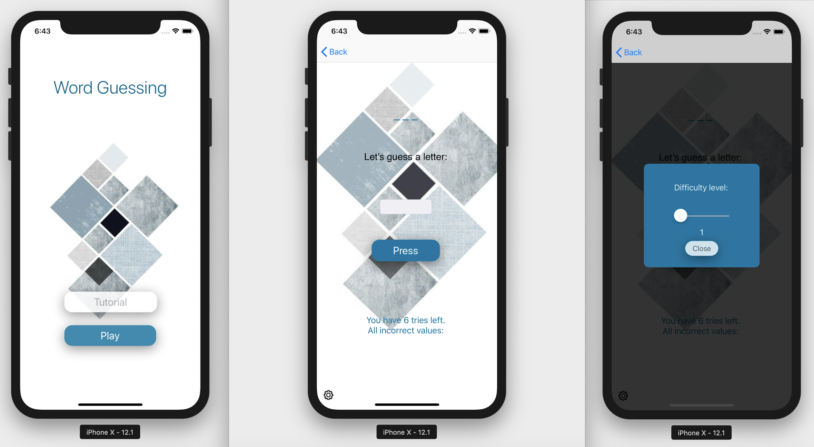

# WORD GUESSING GAME

### DEVELOPER'S NOTE
This game currently is designed for the iPhone X and has only been tested with this model. Other iPhone versions may not have correct visualization for the game.

## GAMEPLAY'S CONTENT

The game is written based on a well-known name called The Hang Man. In the game, the player guesses secret words provided by the computer. In this game, we use REST API by REACH program as our source of data.

First off, the secret word will be displayed as underscores (the number of underscores is the length of the word).

The player will have 6 tries per game, if he/she guesses 6 letters that are not included in the secret word, the player loses the game. In the contrary, the player wins the game if they guess the correct word.

When the player enters a wrong letter, it will be stored and displayed on the screen. After 6 times entering 6 incorrect letters, there will be a popup showing that the player has lost the game. The player can press the "New Game" button to play a new game.

When the player enters a correct letter, the underscore that stores the letter will be revealed. After the player finishes entering the correct word, there will be a popup to congratulate the player as well as a button to reset the game.

There is also an option button for the player to edit the difficulty level which runs from 1 through 10. After setting the difficulty level, the game will reset to that level.

## NAVIGATION OF THE APP

The screenshot above is the main storyboard of my app. The navigation of the game is quite simple with a Navigation controller and serves the following purposes:

1. Helps navigate back and forth between the main menu of the game (controlled by MenuPageViewController.swift) and the tutorial page (TutorialViewController.swift)
2. Helps navigate between the main menu and the gameplay page (controlled by ViewController.swift).
3. In the ViewController.swift, there is a sub view that shows a popup menu (controlled by PopupViewController.swift).

## THE ACTUAL VIEW

The game starts with an animation splash screen which was imported using Lottie CocoaPod as seen in the image below.

   

_(Actual view 1)_

When the player plays the game, after the loading screen, there will be the main menu with 2 options: Tutorial and Play (see Actual view 1).

- --When the player taps on Tutorial button, it will redirect the player to the tutorial page
- --When the player taps on Play button, it will redirect the player to the gameplay page. Here, at the bottom left of the screen, the player can find a slider to modify the game&#39;s difficulty level (see Actual view 2).

_(Actual view 2)_

Let&#39;s take a look at how the game runs (Actual view 3):

1. Displayed underscores: This is where the secret word first shows up during the game, the length of the secret word equal to the numbers of underscores.
2. UITextfield: Where the player enters their guess

3. Press button: After the player entering the input, they press the button to check the result

4. UILabel: Show the number of tries left and to store player&#39;s input incorrect characters

5. When the player enters a correct letter, the underscore will be revealed and shows the correct letter (see Actual view 4).

   
</>
  
_(Actual view 3)_
  

 
   

_(Actual view 4)_

Additionally, below are the actual look of the game when the player enter input:

1. If the input is invalid (inputting a number, special symbol, or \&gt;=2 letters), then an invalid input popup will appear. Also, when the player enters an incorrect letter, the wrong guess popup will show up to warn the player (see Actual view 5).

_(Actual view 5)_

1. If the player loses the game, the &quot;Game&#39;s Over&quot; popup appears. If the player correctly guesses the secret word, the &quot;Congrats!!!&quot; popup will appear (see Actual view 6).

_(Actual view 6)_

## BEHIND THE SCENE

- The REST API used in this game:

Word Dictionary APIprovided by the Linkedin REACH program (source: [**http://app.linkedin-reach.io/words**](http://app.linkedin-reach.io/words)**)**

- Purpose:

The API was used to retrieve a dictionary list of words. From this list of word, the computer will choose a random word as the game&#39;s secret word.

- Parameters used:

URL Parameter: difficulty – Legal values: Integer from 1-10

Filters returned words based on the difficulty level provided: 1 is the lowest level and 10 is the highest level.
